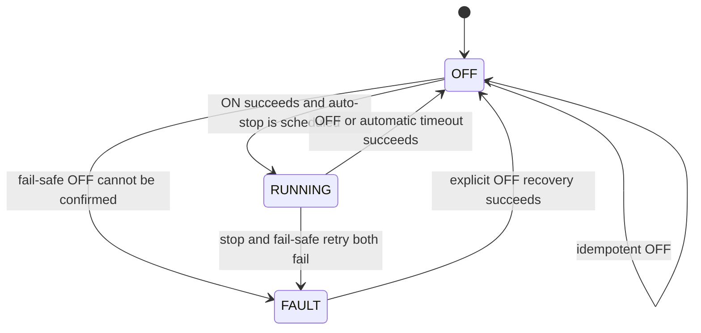

# Edge hardware architecture

## Hardware adapter scope (AGM-002)

This layer integrates the validated NexusGuard hardware drivers only. It does
not contain MQTT, irrigation decision logic, schedules, cloud persistence, or
user-interface behavior. Broader edge services belong to later tickets.

## Sensor application boundary (AGM-004)

`SensorService` depends on the small `AirSensorPort`, `SoilSensorPort`, and
`TankSensorPort` capabilities. It reads every device independently and returns
an internal `SensorSnapshot`; it does not construct MQTT telemetry, persist
data, make irrigation decisions, or control the pump. Wire-contract conversion
belongs at a later transport boundary.

Each measurement carries its unit, UTC observation time, quality, and a typed
error when degraded. Quality has these precise meanings:

- `valid`: a finite, range-valid value was observed during this capture;
- `unavailable`: the adapter reported an error before any valid value existed;
- `failed`: the port raised unexpectedly before any valid value existed;
- `invalid`: the adapter returned a missing, non-finite, or out-of-range value;
- `stale`: the current read failed or was invalid, so the service retained the
  last valid value and its original observation time.

One sensor failure never prevents reads from the other sensors. Percentage
values are validated from 0 through 100; raw ADC, distance, and water height
must be non-negative. Tank measurements remain system state and are not
agronomic ML features.

The minimal `PumpPort` and its in-memory fake exist because AGM-004 requires
real and fake actuator boundaries. They expose only the raw relay capability.
They do not add a safety policy, command handler, schedule, or automatic
irrigation behavior; those concerns begin with AGM-005, where every request
must still pass Raspberry Pi safety rules.

## Fake hardware and logs

`adapters/fake/` contains deterministic scripted air, soil, and tank sensors,
plus an in-memory pump. Scripts can represent valid readings, adapter-reported
unavailability, exceptions, invalid values, and recovery without importing Pi
libraries. Exhausting a script is an explicit error rather than hidden random
behavior.

The sensor service emits structured `sensor_read_degraded` and
`sensor_recovered` records with sensor name, typed error code, and correlation
ID. Raw exception text and configuration values are not logged, preventing
device-library messages from leaking secrets or unstable details.

## Cloud telemetry boundary (AGM-006)

`SensorService` remains transport-independent. `TelemetryMapper` converts only
the four approved snapshot measurements into AGM-003 wire contracts, and
`CloudMqttService` publishes them through `MqttTransport`. The production Paho
adapter owns TLS, credentials, LWT, the asynchronous network loop, and bounded
reconnect configuration; tests replace it with `FakeMqttTransport`.

Connection loss cannot actuate the pump or weaken AGM-005. AGM-008 adds a
durable boundary without adding GPIO knowledge to MQTT code.

## Local event store and outbox (AGM-008)

SQLite stores only canonical `Telemetry` and `CommandAcknowledgement` events,
with their exact MQTT publication metadata. Event insertion and pending-outbox
creation are one transaction. Device status/LWT, inbound commands,
`SensorSnapshot`, and future irrigation results are deliberately excluded.

Pending rows are replayed deterministically by contract occurrence time and
event ID. A row becomes delivered only after the broker-neutral publish receipt
confirms the QoS 1 PUBACK. Replay is at-least-once: a crash after PUBACK but
before the SQLite delivery update can publish a duplicate, so consumers must
deduplicate by `message_id` or `acknowledgement_id`.

Both pending and delivered events are removed when their contract timestamp is
24 hours old. Cleanup uses an injected UTC clock and logs counts only. If
SQLite is unavailable, connected MQTT receives one best-effort direct publish
with an explicit loss-of-durability log; if MQTT is unavailable too, the loss
is logged without payload data and local sensor/pump safety continues.

The same database holds a narrow processed-command register. It stores the
command fingerprint and latest ACK, never a replayable inbound command. An
exact duplicate after restart replays the saved ACK without actuation; changed
content under the same ID is rejected. Expired register rows are pruned.

## Safe pump command boundary (AGM-005)

The local path is deliberately transport-independent:

```text
validated PumpCommand -> PumpCommandHandler -> SafePumpController
                      -> PumpPort -> active-low hardware adapter
```

MQTT clients will be authenticated and topics cross-checked by later transport
work. At this boundary, a structurally valid command is still not authority to
actuate: its farm and device must match the locally provisioned identity, it
must be current, and an `on` duration must not exceed the local safety limit.
`requested_by` remains audit metadata, not authentication proof.

The AGM-005 controller exposes the minimum observable state required by this
capability:



Starting and stopping occur synchronously under a lock, so they are not exposed
as durable states. `VERIFY_PENDING` belongs to later irrigation-result work.
Command handling is serialized in-process; overlapping `on` commands are
rejected and cannot replace the active timer. Cancelled timers carry a cycle
identifier and cannot stop a later run.

An accepted `on` acknowledgement is created only after the adapter reports ON
and a bounded automatic stop is scheduled. The timeout emits a later
`completed` or `failed` acknowledgement through an injected sink. `off` emits
`completed` only after OFF is confirmed; already-OFF is a completed no-op.
Actuation or scheduler exceptions produce `failed`, while policy decisions
produce `rejected`. Stable snake-case reason codes are used instead of raw
exception text.

QoS 1 duplicates are handled using an in-memory map keyed by `command_id`,
backed by AGM-008's processed-command register when persistence is composed.
Exact duplicates replay the stored acknowledgement without physical actuation;
reuse of an ID with changed command content is rejected. Completed automatic
stop outcomes replace the earlier accepted outcome for subsequent replay.
The register survives a process restart and is lookup-only at startup: stored
commands are never executed or replayed into the pump.

The v1 wire contract permits 1-600 seconds. The local
`AGRIMIND_PUMP_MAX_DURATION_SECONDS` must also be 1-600 and defaults to 600 so
no unverified agronomic limit is invented. Requests above the configured local
limit are rejected, never silently clamped. Contract parsing rejects missing,
zero, negative, or wire-oversized durations before this handler is called.

Every actuation/timer failure attempts OFF. If the initial operation fails but
the OFF retry succeeds, the acknowledgement remains `failed` and explicitly
reports the recovered OFF state. If OFF cannot be confirmed, state becomes
`fault` and no false physical-safety claim is made. Shutdown cancels the timer,
forces OFF, then cleans up the adapter. No sensor threshold or agronomic rule
is introduced; future safety interlocks can be placed before the controller.

## Authoritative physical mapping

| Component | Verified configuration | Prototype behavior |
|---|---|---|
| DHT22 | BCM GPIO 17 | `use_pulseio=False`; temperature and relative humidity |
| Pump relay | BCM GPIO 18 | Active-low: LOW is ON, HIGH is OFF |
| HC-SR04 | Trigger BCM 23, echo BCM 24 | 10 us trigger pulse; 1-second echo timeouts |
| Soil sensor | ADS1115 channel A0 over I2C | Ten readings averaged; 50 ms between reads |

The specification's DHT22 GPIO 4 and relay GPIO 17 were explicitly marked
indicative/to-confirm. They are not used because the working physical prototype
and its source code verify GPIO 17 and 18 respectively.

## Driver boundaries and provenance

The adapters in `edge/src/agrimind_edge/adapters/hardware/` derive from the
NexusGuard files supplied for AGM-002:

- `sensors/dht22.py`: lazy device creation, three reads by default, two-second
  spacing after transient `RuntimeError`, one-decimal results, and cleanup on a
  terminal error.
- `sensors/soil.py`: lazy ADS1115 A0 channel, ten-sample integer average, 50 ms
  sampling delay, `DRY=28000` / `WET=11000` linear conversion, and 0-100 clamp.
- `sensors/ultrasonic.py`: BCM setup, 200 us settle, 10 us trigger, one-second
  rising/falling echo timeouts, `distance * 17150`, and the existing tank-level
  formula.
- `actuators/pump.py`: lazy BCM setup, active-low output, logical state, and
  best-effort safe cleanup.

Behavior is preserved while module globals are replaced by adapter instances
and injected minimal protocols. These are intentional testability changes, not
changes to sensor formulas or GPIO semantics. The only new input guards reject
invalid retry/sample counts and invalid physical configuration before hardware
access. One intentional safety improvement supplies `initial=HIGH` while GPIO
18 is configured as an output, preventing an active-low startup pulse before
the prototype's explicit HIGH/OFF write.

Raspberry Pi libraries are imported only when a `.raspberry_pi(config)` factory
is called. Importing the package on a developer or CI machine cannot initialize
GPIO, I2C, or a sensor.

## Pump safety

Constructing `PumpRelay` has no physical side effect. The owning runtime must
call `initialize()` during controlled startup; it configures BCM GPIO 18 as an
output and immediately writes HIGH/OFF. `turn_on()` also initializes safely
before writing LOW. `turn_off()` writes HIGH. `cleanup()` attempts HIGH before
releasing only GPIO 18 and always resets the logical state to OFF.

Automated tests use `FakeGPIO` and never import `RPi.GPIO` or energize a relay.
AGM-002 does not claim supervised physical verification; that remains an
explicit Raspberry Pi activity.

## Calibration and tank assumptions

The soil calibration values are inherited from the working prototype. They
must be re-measured for the actual probe and substrate before agronomic use.
The formula supports either calibration ordering but rejects equal endpoints.

Tank height 30 cm and sensor offset 2 cm are preserved from prototype config,
but conflict with the small reservoir dimensions described elsewhere in the
specification. Until physically calibrated, HC-SR04 output is monitoring-only
system state and is not a critical pump interlock or an ML feature.

## Raspberry Pi installation and smoke test

Use Raspberry Pi OS with I2C enabled. In a virtual environment:

```bash
python3 -m pip install -e "./edge[hardware]"
```

Create and validate `HardwareConfig` before constructing real adapters. Any
physical pump test must be supervised, begin with the water path secured, and
verify HIGH/OFF before allowing a LOW/ON command. No automated test suite may
instantiate the real pump factory.

For a supervised AGM-004 sensor smoke test, construct the real adapters from
the validated `HardwareConfig`, inject them into `SensorService`, and capture
several snapshots. Verify UTC timestamps and plausible values, then disconnect
one sensor and confirm the other readings remain valid while the affected
measurements become `stale` (after a prior success) or `unavailable`/`failed`.
Reconnect it and confirm a `sensor_recovered` record and fresh values. This is
a manual procedure only; no physical result is claimed by AGM-004 CI.

For supervised AGM-005 validation, secure the water path and use a short local
maximum. Confirm relay HIGH/OFF at boot, issue one bounded `on`, verify LOW/ON,
then verify automatic HIGH/OFF at the deadline. Repeat with manual `off`, a
duplicate command ID, an expired command, and a controlled process shutdown;
only the first valid `on` may energize the relay. Record observations separately
from CI. AGM-005 automated results use `FakePump` and do not claim this physical
procedure was performed.

## Legacy `app.py`

The inspected NexusGuard `app.py` is a Flask/Socket.IO local dashboard and
orchestration shell. It starts the legacy sensor loop, holds mutable global
state, changes thresholds at runtime, and calls the pump directly from REST and
WebSocket handlers. It also contains hard-coded demo users/session secret and
permissive CORS.

It is not copied into AgriMind and is not an architectural dependency. Flutter
will be the user-facing application. The useful hardware behavior was taken
from the dedicated driver modules; automatic decision logic from legacy
`main.py` is deliberately deferred to later tickets.

## Hardware-free tests

`pytest` supplies scripted DHT/ADC values, a scripted clock, and fake GPIO.
Coverage includes calibration bounds, averaging/timing, retry/error handling,
ultrasonic timing/timeout/calculation, active-low output, safe initialization
and cleanup, and configuration rejection. AGM-004 additionally covers port
compatibility, deterministic fakes, complete and partial snapshots, invalid
values, stale fallback, recovery, UTC validation, structured safe logs, and
imports without GPIO. AGM-005 adds deterministic scheduler and pump tests for
state transitions, bounded timeout, duplicates, target/expiry policy,
overlapping commands, failure recovery, and shutdown. Run the complete suite:

```bash
make check
```
