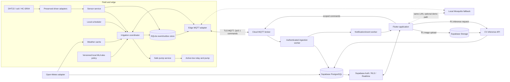
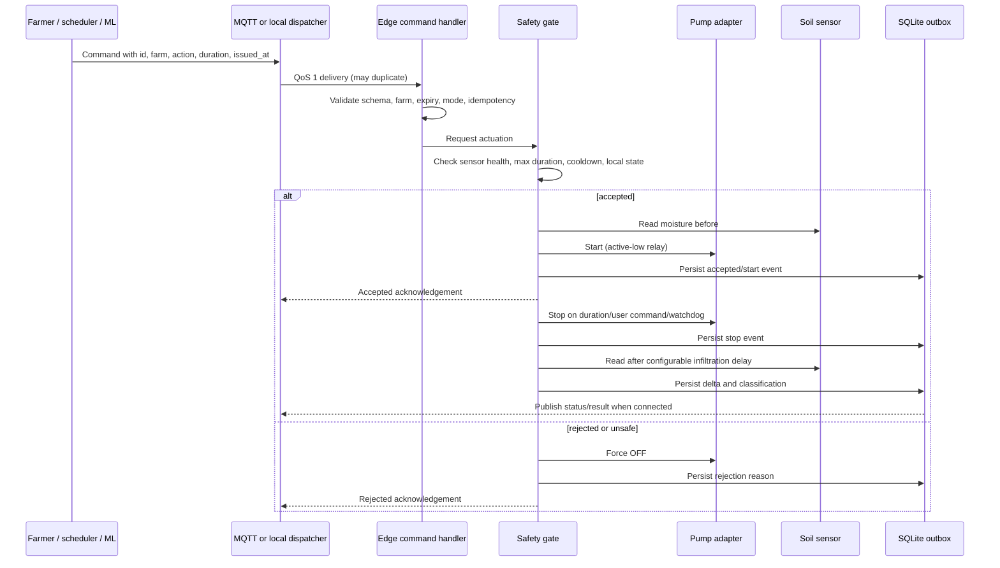

# System architecture

## Architectural stance

AgriMind is an edge-first modular monorepo. The Raspberry Pi owns physical
safety and remains useful offline. Cloud services persist, coordinate, and
present data but cannot bypass local interlocks. Ports separate hardware,
transport, persistence, weather, and model inference so domain behavior is
testable without GPIO, Internet, or a broker.

## System context



## Irrigation command and verification flow



QoS 1 implies duplicates. Every command therefore carries a unique
`command_id`; the edge stores processed IDs and returns the prior result rather
than actuating twice.

## Component boundaries

- **Drivers:** the existing modules remain thin Raspberry Pi-specific adapters.
- **Domain:** sensor snapshots, irrigation modes, recommendations, schedules,
  safety policy, events, and feedback classification; no GPIO/MQTT/Supabase.
- **Application services:** orchestrate use cases and transaction boundaries.
- **Infrastructure:** MQTT, SQLite, Open-Meteo, Supabase ingestion, clocks, and
  model loading.
- **Mobile:** feature-first Flutter modules using repositories; Riverpod is the
  proposed state/dependency management choice because it is testable and avoids
  widget-context coupling without introducing a full enterprise framework.
- **Backend:** migrations are the database source of truth. RLS authorizes user
  access; a server-side ingestion worker performs privileged device writes.

## Safe edge state machine

`OFF -> STARTING -> RUNNING -> STOPPING -> VERIFY_PENDING -> OFF`, with
`FAULT` reachable from every state. Boot, process termination, expired command,
watchdog timeout, critical sensor failure during automatic operation, and
unhandled exception all force relay HIGH/OFF. Manual operation still respects
hard duration and hardware safety limits.

## Data ownership

- Edge SQLite is the source of truth for not-yet-synchronized physical events.
- Supabase is the durable user-facing history after acknowledged ingestion.
- MQTT is transport, never durable business storage.
- The model recommendation is advisory input; the edge safety gate owns the
  final actuation decision.
- `event_id`/`reading_id` UUIDs generated at source provide idempotent cloud
  ingestion. Server timestamps and device timestamps are both retained.

## Proposed repository structure

```text
AgriMind/
├── edge/
│   ├── src/agrimind_edge/
│   │   ├── domain/             # entities, policies, state machine
│   │   ├── application/        # use cases and ports
│   │   ├── adapters/
│   │   │   ├── hardware/       # preserved NexusGuard drivers + fakes
│   │   │   ├── mqtt/
│   │   │   ├── persistence/    # SQLite outbox/cache
│   │   │   ├── weather/
│   │   │   └── ml/
│   │   ├── config/
│   │   └── entrypoints/
│   ├── tests/{unit,integration,hardware}/
│   └── pyproject.toml
├── mobile/
│   ├── lib/
│   │   ├── app/
│   │   ├── core/{config,theme,mqtt,errors,widgets}/
│   │   └── features/{auth,onboarding,dashboard,irrigation,weather,farm,visual_monitoring,history,notifications,settings}/
│   ├── test/
│   └── integration_test/
├── backend/
│   ├── supabase/{migrations,functions,tests}/
│   └── services/{ingestion,cv_inference}/
├── ai/
│   ├── irrigation/{configs,data_contracts,src,tests,artifacts}/
│   └── computer_vision/{configs,data_contracts,src,tests,artifacts}/
├── contracts/                  # versioned JSON Schemas shared across boundaries
├── deploy/{mosquitto,systemd,docker}/
├── docs/{architecture,adrs,api,mqtt,ml,planning,testing}/
├── scripts/
├── .github/workflows/
├── .env.example
└── README.md
```

Compared with the initial suggestion, this adds shared wire contracts, explicit
deployment configuration, a cloud ingestion service, and edge application
ports. It avoids a generic top-level `datasets/` directory: raw datasets are not
committed unless licensing and size policy permit it.

## Security boundaries

- Broker ACLs restrict devices to their farm telemetry/status and command
  subscriptions; users receive only authorized farm topics.
- Commands are schema-validated, expiry-bounded, idempotent, allow-listed, and
  logged. Payload `user_id` is audit metadata, not authorization proof.
- The mobile app has only the Supabase anonymous key and user JWT; never a
  service-role key or shared device secret.
- Edge secrets live in a root-readable environment file or secret manager, not
  Git. TLS verification is mandatory in cloud mode.
- RLS is tested with two-user negative cases for every exposed table and Storage
  bucket.
- Images use private buckets and signed access; inference input type, size, and
  decode limits are enforced.

## Architecture decisions to record during implementation

- ADR-001 monorepo and boundary model.
- ADR-002 broker selection, ACLs, and local fallback behavior.
- ADR-003 Flutter Riverpod and repository boundaries.
- ADR-004 device ingestion authentication and service-role isolation.
- ADR-005 local model versus conservative rules fallback and artifact format.

These ADRs should be written when the corresponding ticket validates the choice,
not pre-filled with assumptions now.
