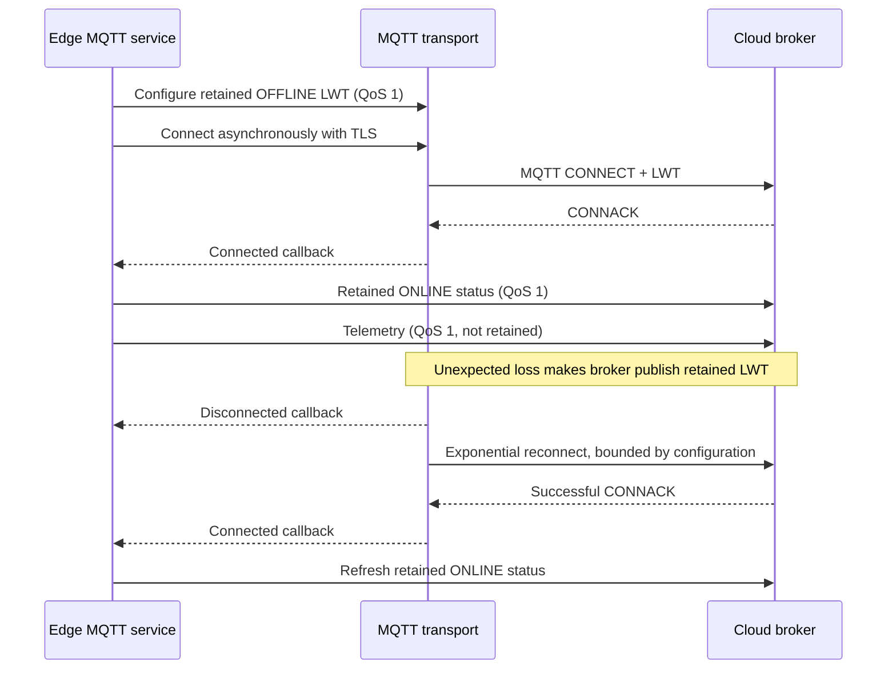

# MQTT v1 wire contract

Status: AGM-003 defines contracts; AGM-006/007 implement cloud lifecycle,
telemetry, commands, and ACKs; AGM-008 durably buffers telemetry and ACKs.
AGM-009 adds single-active local Mosquitto fallback without changing v1 topics.
AGM-012 consumes telemetry and status through a trusted server-side worker.

## AGM-006 connection lifecycle



The Paho adapter is confined to infrastructure. Application code depends on an
`MqttTransport` port and receives only connected/disconnected callbacks. The
adapter uses an asynchronous network loop, with reconnect delay starting at
`AGRIMIND_MQTT_RECONNECT_MIN_SECONDS`, doubling between failed attempts, and
capped at `AGRIMIND_MQTT_RECONNECT_MAX_SECONDS`. Broker loss changes connection
state and suppresses new telemetry publication; it has no pump capability and
cannot bypass AGM-005.

While disconnected, telemetry is inserted into the local SQLite event/outbox
store. Reconnection requests an ordered background drain so the Paho callback
is not blocked. ACKs use the same durable path. Device presence and LWT remain
direct retained publications and are never inserted into the outbox.

During local fallback, the same exact topics and QoS rules apply. Only the
active broker receives the command subscription. Local PUBACKs never mark the
Cloud outbox delivered; pending events are replayed to Cloud after controlled
recovery. Broker selection never changes command validation or pump safety.

## Common rules

- Wire version: `v1` in topics and `schema_version: 1` in payloads.
- Encoding: UTF-8 JSON object; deterministic Python output uses sorted keys and
  compact separators. Consumers must not depend on JSON key order.
- Identifiers: lowercase, hyphenated, non-zero UUID strings.
- Time: RFC 3339 UTC ending in `Z`; producers emit millisecond precision.
- Unknown fields, unsupported versions/enums, malformed IDs/timestamps, and
  nonfinite numbers are rejected.
- Payloads never contain credentials. Arrival through MQTT is transport, not
  authorization and never bypasses Raspberry Pi safety checks.
- Language-neutral JSON Schemas are in `contracts/v1/`; edge runtime models are
  in `agrimind_edge.contracts`.

## Canonical topics

All topic strings are constructed by `TopicBuilder`, not concatenated at call
sites. They are lowercase ASCII:

```text
agrimind/v1/farms/{farm_id}/devices/{device_id}/telemetry/{metric}
agrimind/v1/farms/{farm_id}/devices/{device_id}/commands/pump
agrimind/v1/farms/{farm_id}/devices/{device_id}/acks/{command_id}
agrimind/v1/farms/{farm_id}/devices/{device_id}/status/device
agrimind/v1/farms/{farm_id}/devices/{device_id}/events/irrigation_result
```

Topic farm/device IDs must equal the corresponding payload fields. That
cross-check is enforced by AGM-007 for commands and by AGM-012 for telemetry
and status. AGM-012 additionally derives the authoritative farm from the
registered device instead of trusting either incoming copy.

| Topic suffix | Direction | Purpose | QoS/retained |
|---|---|---|---|
| `telemetry/{metric}` | edge -> broker | One sensor measurement | QoS 1 / no |
| `commands/pump` | trusted client -> edge | Request bounded ON or OFF | QoS 1 / never retained |
| `acks/{command_id}` | edge -> client | Correlated command outcome | QoS 1 / no |
| `status/device` | edge -> broker | Heartbeat/last device state | QoS 1 / retained |
| `events/irrigation_result` | edge -> broker | VERIFY feedback result | QoS 1 / no |

## Telemetry

Schema: `contracts/v1/telemetry.schema.json`.

Example on `.../telemetry/soil_moisture`:

```json
{
  "schema_version": 1,
  "message_id": "33333333-3333-4333-8333-333333333333",
  "farm_id": "11111111-1111-4111-8111-111111111111",
  "device_id": "22222222-2222-4222-8222-222222222222",
  "metric": "soil_moisture",
  "value": 65.2,
  "unit": "%",
  "recorded_at": "2026-09-22T08:00:00.000Z",
  "quality": "valid"
}
```

| Field | JSON type | Required | Validation |
|---|---|---:|---|
| `schema_version` | integer | yes | exactly `1` |
| `message_id` | string | yes | canonical non-zero UUID; deduplication identity |
| `farm_id` | string | yes | canonical non-zero UUID |
| `device_id` | string | yes | canonical non-zero UUID |
| `metric` | string enum | yes | `soil_moisture`, `temperature`, `humidity`, `tank_level` |
| `value` | number | yes | finite JSON number; no NaN/infinity |
| `unit` | string enum | yes | soil/humidity `%`; temperature `°C`; tank level `cm` |
| `recorded_at` | string | yes | UTC RFC 3339 timestamp |
| `quality` | string enum | yes | `valid` or `estimated` |

Telemetry contains a raw measurement only. Agronomic recommendations, pump
state, and tank-based safety decisions do not belong in this message.

AGM-006 maps `SensorSnapshot` without changing that internal model:

- fresh temperature, air humidity, soil moisture, and tank water height become
  `valid` telemetry;
- stale cached values become `estimated` and preserve their original UTC
  observation time;
- unavailable, invalid, and failed readings have no finite v1 value and are
  omitted rather than fabricated;
- tank telemetry uses water height in centimetres, never tank percentage as an
  agronomic feature.

Each mapped measurement is published to `TopicBuilder.telemetry(...)` with QoS
1 and `retain=false`. SQLite records `broker_accepted` after PUBACK and records
`cloud_confirmed` only after a validated AGM-013 application receipt. A crash
at either boundary can produce an at-least-once duplicate.

The AGM-012 subscriber rejects retained telemetry, validates the existing v1
schema, cross-checks topic/payload/registry identity, and accepts data only from
an active registered device. Readings older than 24 hours or more than five
minutes in the future are rejected by default; both operational limits are
configurable. Database `message_id` uniqueness turns exact QoS 1 redelivery
into a successful no-op and rejects changed content under the same ID.

## Telemetry ingestion acknowledgement

Schema: `contracts/v1/ingestion-acknowledgement.schema.json`.

```text
agrimind/v1/farms/{farm_id}/devices/{device_id}/sync/acks/{message_id}
```

The trusted worker publishes this with QoS 1 and `retain=false` after
`inserted`, exact `duplicate`, or a safely correlatable permanent rejection.
Statuses are `persisted`, `duplicate`, and `rejected`; only `rejected` includes
a stable `reason_code`. Transient failures and uncorrelatable input produce no
terminal receipt. Payloads contain no telemetry, exception, SQL text, or
credential.

The worker may publish `agrimind/v1/farms/+/devices/+/sync/acks/+`. A device
may subscribe only to `.../sync/acks/+` under its exact farm/device base and
may not publish receipts, subscribe cross-device/cross-farm, or use a broader
wildcard. The edge still verifies topic and payload identity.

`rejected` is terminal and is not replayed. All states are purged when the
original observation reaches 24 hours. Near that boundary, clock alignment
and latency can cause local expiry or Cloud stale rejection. Status remains a
direct retained current-state message and is excluded. There is no total order
across telemetry topics and no exactly-once or zero-data-loss claim.

## Pump command

Schema: `contracts/v1/pump-command.schema.json`.

Example on `.../commands/pump`:

```json
{
  "schema_version": 1,
  "command_id": "44444444-4444-4444-8444-444444444444",
  "farm_id": "11111111-1111-4111-8111-111111111111",
  "device_id": "22222222-2222-4222-8222-222222222222",
  "action": "on",
  "duration_seconds": 30,
  "issued_at": "2026-09-22T08:00:00.000Z",
  "expires_at": "2026-09-22T08:00:30.000Z",
  "requested_by": "55555555-5555-4555-8555-555555555555"
}
```

| Field | JSON type | Required | Validation |
|---|---|---:|---|
| `schema_version` | integer | yes | exactly `1` |
| `command_id` | string | yes | canonical non-zero UUID; idempotency key |
| `farm_id` | string | yes | canonical non-zero UUID |
| `device_id` | string | yes | canonical non-zero UUID |
| `action` | string enum | yes | `on` or `off`; no implicit toggle |
| `duration_seconds` | integer | for `on` only | 1 through 600 inclusive; forbidden for `off` |
| `issued_at` | string | yes | UTC RFC 3339 timestamp |
| `expires_at` | string | yes | UTC, strictly after issue time and future at receipt |
| `requested_by` | string | yes | canonical non-zero user/service UUID for audit only |

`requested_by` is not proof of authorization. The default deserializer rejects
expired commands. AGM-007 uses the explicit structural deserializer so the
existing local command handler remains the sole authority for expiry and
future-issued decisions. That path preserves every other v1 validation rule.
This contract does not perform GPIO actuation.

After every MQTT connection or reconnection, the edge subscribes again to its
exact `TopicBuilder.pump_command()` topic at QoS 1. Retained commands and
messages received on other topics are ignored without actuation. No production
edge subscription uses a broad wildcard.

## Command acknowledgement

Schema: `contracts/v1/command-acknowledgement.schema.json`.

Example rejection on `.../acks/44444444-4444-4444-8444-444444444444`:

```json
{
  "schema_version": 1,
  "acknowledgement_id": "33333333-3333-4333-8333-333333333333",
  "command_id": "44444444-4444-4444-8444-444444444444",
  "farm_id": "11111111-1111-4111-8111-111111111111",
  "device_id": "22222222-2222-4222-8222-222222222222",
  "status": "rejected",
  "occurred_at": "2026-09-22T08:00:01.000Z",
  "reason_code": "safety_interlock",
  "pump_state": false
}
```

| Field | JSON type | Required | Validation |
|---|---|---:|---|
| `schema_version` | integer | yes | exactly `1` |
| `acknowledgement_id` | string | yes | canonical non-zero UUID |
| `command_id` | string | yes | original command UUID; must match topic suffix |
| `farm_id`, `device_id` | string | yes | canonical non-zero UUIDs |
| `status` | string enum | yes | `accepted`, `rejected`, `completed`, `failed` |
| `occurred_at` | string | yes | UTC RFC 3339 timestamp |
| `reason_code` | string | rejected/failed only | lowercase snake_case, max 64 |
| `pump_state` | boolean | no | observed logical pump state when available |

Reason codes are stable codes, not free-form secret-bearing diagnostics.
`accepted` means the edge accepted the request; `completed` means the requested
action completed. A published command is neither.

`invalid_command` is used only when a canonical non-zero `command_id` can be
extracted but the complete v1 `PumpCommand` fails validation. The edge publishes
a correlated `rejected` ACK without actuation. Invalid JSON and payloads with a
missing or noncanonical `command_id` cannot be correlated, so they produce no
ACK and are logged without including the untrusted payload.

Valid ON commands produce `accepted` only after ON is confirmed, followed by
`completed` or `failed` when the bounded automatic stop runs. Valid OFF commands
produce `completed` directly after OFF is confirmed. Every ACK uses QoS 1 and
`retain=false` on `TopicBuilder.acknowledgement(command_id)`.

Exact duplicate commands replay the most recent stored ACK without another
physical action. Reusing a `command_id` with different command content produces
`command_id_conflict`. AGM-008 persists the command fingerprint and latest ACK,
so this holds across restart. Stored commands are never executed at startup.

## Device status

Schema: `contracts/v1/device-status.schema.json`.

Example on `.../status/device`:

```json
{
  "schema_version": 1,
  "message_id": "33333333-3333-4333-8333-333333333333",
  "farm_id": "11111111-1111-4111-8111-111111111111",
  "device_id": "22222222-2222-4222-8222-222222222222",
  "online": true,
  "pump_state": false,
  "health": "healthy",
  "recorded_at": "2026-09-22T08:00:00.000Z",
  "uptime_seconds": 3600,
  "firmware_version": "0.1.0",
  "errors": []
}
```

| Field | JSON type | Required | Validation |
|---|---|---:|---|
| `schema_version` | integer | yes | exactly `1` |
| `message_id`, `farm_id`, `device_id` | string | yes | canonical non-zero UUIDs |
| `online` | boolean | yes | connection/heartbeat representation |
| `pump_state` | boolean | yes | last known logical pump state |
| `health` | string enum | yes | `healthy`, `degraded`, `fault` |
| `recorded_at` | string | yes | UTC RFC 3339 timestamp |
| `uptime_seconds` | integer | yes | zero or greater |
| `firmware_version` | string | yes | 1-64 characters |
| `errors` | string array | yes | up to 16 lowercase snake_case codes, max 64 each |

Later MQTT work may use the same shape for heartbeat and LWT-derived offline
state. AGM-006 configures the LWT before connecting and publishes current
ONLINE status after every successful connection/reconnection. Both use the
device-status topic, QoS 1, and `retain=true`, so consumers see the most recent
presence state. A graceful stop first publishes retained OFFLINE and then
disconnects; an unexpected session loss makes the broker publish the retained
LWT.

Because MQTT requires the will payload during CONNECT, its `recorded_at`, pump
state, uptime, and health are a connection-time snapshot, not a measurement at
the later instant of network loss. The LWT sets `online=false`, records
`mqtt_session_lost`, and degrades otherwise-healthy status. It must not be used
as an actuator command or proof of current physical pump state.

## TLS and broker requirements

The cloud adapter is broker-neutral and requires MQTT 3.1.1 over verified TLS:

- a configured CA file is loaded into a default Python TLS context;
- certificate validation and hostname checking remain enabled;
- TLS 1.2 is the minimum accepted protocol;
- username/password authentication is configured before connection and never
  placed in topics, payloads, or logs;
- no public broker, certificate, private key, or working credential is stored
  in the repository.

The broker must support QoS 1, retained publications, LWT, TLS with a trusted
certificate matching the configured hostname, and per-client ACLs.

The ingestion worker uses a separate read-only broker principal, a stable
client ID, persistent session semantics, QoS 1 wildcard subscriptions limited
to telemetry and status, and manual message acknowledgment. Permanent invalid
input is acknowledged to prevent a poison-message loop. A transient Supabase
failure is not acknowledged and forces reconnect/redelivery. HiveMQ Cloud
persistent-session retention and outage behavior have not been supervised end
to end, so this is not a claim of guaranteed broker durability.

## Device ACL design

Authentication establishes which broker principal connected. Authorization is
the separate broker policy that constrains that principal. Topic UUIDs alone
are not authentication.

For one provisioned `{farm_id}/{device_id}`, AGM-006 requires only exact publish
permissions for:

```text
agrimind/v1/farms/{farm_id}/devices/{device_id}/telemetry/temperature
agrimind/v1/farms/{farm_id}/devices/{device_id}/telemetry/humidity
agrimind/v1/farms/{farm_id}/devices/{device_id}/telemetry/soil_moisture
agrimind/v1/farms/{farm_id}/devices/{device_id}/telemetry/tank_level
agrimind/v1/farms/{farm_id}/devices/{device_id}/status/device
```

AGM-007 adds only the exact `.../commands/pump` subscribe permission and the
device-owned `.../acks/+` publish filter needed for correlated UUID ACK topics.
It must not add cross-farm access, `agrimind/#`, `+/devices/+`, or a broad device
subtree. `DeviceAclPolicy` tests these vendor-neutral rules; the equivalent
broker-specific syntax must be validated during deployment.

## Supervised cloud validation

With separately provisioned test credentials and a trusted CA, configure a
non-production broker, observe LWT registration before CONNECT, and confirm the
retained ONLINE status and four non-retained telemetry topics. Interrupt the
network without graceful disconnect, verify the broker publishes retained
OFFLINE, then restore connectivity and verify bounded reconnect plus refreshed
ONLINE status. Attempt cross-device publishing and confirm the broker rejects
it. Rotate/delete the test credentials afterward.

On 2026-09-23, a supervised HiveMQ Cloud run loaded credentials from the
ignored repository-root `.env` and confirmed the verified-TLS connection,
retained ONLINE status, four QoS 1 non-retained telemetry publications
(temperature, humidity, soil moisture, and tank level), and retained OFFLINE
status after graceful shutdown. Credentials and broker details are not
recorded in the repository.

The unexpected-disconnect LWT delivery, bounded reconnect behavior, and
cross-device ACL rejection were not exercised during that run. Their current
coverage remains the automated transport-boundary and ACL policy tests; they
still require supervised deployment validation.

## AGM-017 mobile telemetry subscription

The authenticated Flutter app resolves its RLS-visible farm and exactly one
active device before opening MQTT. Its dedicated MVP broker principal has only
Subscribe permission on the exact provisioned filter:

```text
agrimind/v1/farms/{farm_id}/devices/{device_id}/telemetry/+
```

The client requests QoS 1, validates every v1 payload and topic identity, and
resubscribes after automatic reconnect. It cannot publish and has no access to
`status/device`, commands, command ACKs, sync ACKs, or irrigation events.
Therefore broker connectivity is displayed as the **mobile MQTT session**, not
as physical device presence. Telemetry timestamps independently drive live,
waiting, and stale-data presentation.

The HiveMQ Free/Serverless MVP uses a manually provisioned static mobile
credential. This is a prototype limitation: a production multi-user system
needs short-lived farm-scoped broker identities or a trusted token exchange.
No broker password is stored in Git.

### AGM-017 supervised Android smoke test

On 2026-09-24, the Android application was validated manually against the real
Supabase project and HiveMQ Cloud Serverless over verified TLS on port 8883.
After authentication, it resolved `sfax farm` and its provisioned active device,
connected with the dedicated Subscribe Only mobile principal, showed the
waiting state without fabricated values, then received and rendered QoS 1 v1
temperature (24.7 °C), humidity (62.5%), soil moisture (48.3%), and tank level
(17.8 cm) telemetry as live data with the latest telemetry timestamp.

This complements, but does not replace, the credential-free automated CI tests
for contracts, filtering, duplicates, ordering, stale data, reconnect, cleanup,
and rendering states. The supervised run did not involve a Raspberry Pi or
GPIO, did not validate edge publication or pump safety, did not exercise
disconnect/reconnect recovery, malformed or cross-identity input, and did not
subscribe to or validate `status/device`. No credential or privileged key is
recorded here.

### AGM-007 fake-pump command validation

From the repository root, explicitly start the supervised command path:

```bash
./.venv/bin/python -m agrimind_edge.entrypoints.mqtt_control_validate \
  --env-file .env --run-seconds 120
```

The command prints the exact command topic, ACK wildcard, and a short-lived
synthetic ON payload. Subscribe in the HiveMQ Web Client to the printed ACK
wildcard, publish the sample payload at QoS 1 with retain disabled to the exact
command topic, and observe `accepted` followed by `completed`. The entry point
uses `FakePump` and `FakeScheduler`; it imports no GPIO and does not validate
physical hardware. It keeps TLS certificate and hostname verification enabled
and never prints MQTT credentials.

On 2026-09-23, this supervised path was validated against HiveMQ Cloud with a
five-second synthetic ON command. The edge published a correlated `accepted`
ACK with `pump_state=true`, followed about five seconds later by `completed`
with `pump_state=false`; both ACKs used the same `command_id`. The run used
`FakePump`, imported no GPIO, and recorded no broker address or credential in
the repository.

## Irrigation result

Schema: `contracts/v1/irrigation-result.schema.json`.

Example on `.../events/irrigation_result`:

```json
{
  "schema_version": 1,
  "event_id": "33333333-3333-4333-8333-333333333333",
  "farm_id": "11111111-1111-4111-8111-111111111111",
  "device_id": "22222222-2222-4222-8222-222222222222",
  "soil_moisture_before": 42.1,
  "soil_moisture_after": 68.3,
  "delta": 26.2,
  "result": "increased",
  "completed_at": "2026-09-22T08:20:00.000Z"
}
```

| Field | JSON type | Required | Validation |
|---|---|---:|---|
| `schema_version` | integer | yes | exactly `1` |
| `event_id`, `farm_id`, `device_id` | string | yes | canonical non-zero UUIDs |
| `soil_moisture_before` | number | yes | finite percentage from 0 through 100 |
| `soil_moisture_after` | number | yes | finite percentage from 0 through 100 |
| `delta` | number | yes | `after - before`, rounded to one decimal |
| `result` | string enum | yes | positive `increased`, zero `unchanged`, negative `decreased` |
| `completed_at` | string | yes | UTC RFC 3339 timestamp after verification |

This represents VERIFY output only. AGM-003 does not start the pump, wait for
infiltration, classify sensor noise, or persist the event.

## Evolution rules

- Consumers reject unsupported `schema_version` and topic version.
- V1 producers do not add undocumented fields because v1 schemas are closed.
- A backward-incompatible semantic change requires a future versioned topic and
  schema; no speculative v2 exists.
- Additive v1 evolution requires coordinated schema, Python, Dart, docs, and
  compatibility-test updates before deployment.
